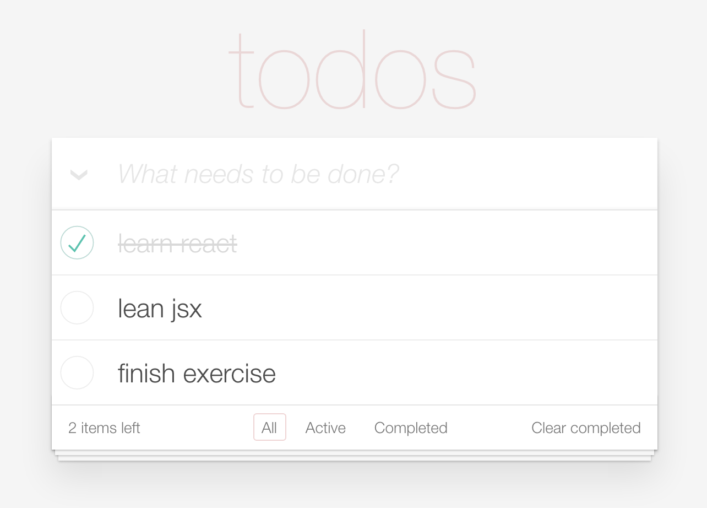

# Practice
## 问题

实例练习：通过组件化的方式优化之前的待办事项列表

组件如下：

1. App 组件：整个页面的最完成组件
2. Header 组件：头部输入组件
3. TodoList 组件：列表组件
4. TodoItem 组件: 列表项
5. Footer 组件：底部操作组件

## 学习资源
[精益 React 学习指南 （Lean React）- 1.3 React组件](https://segmentfault.com/a/1190000005151182)

